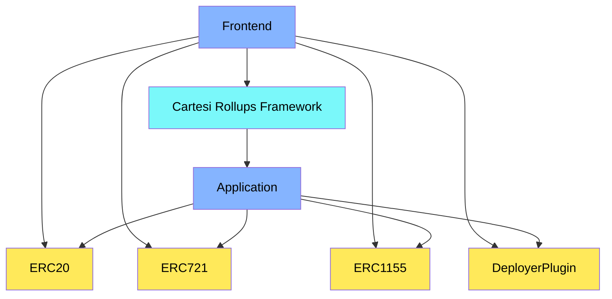
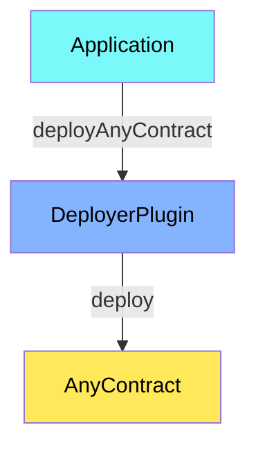
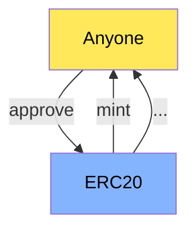
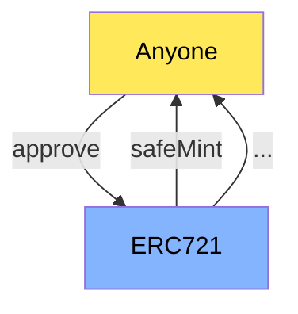
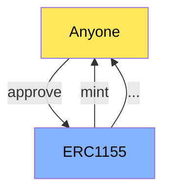

# Contracts

This contracts section found here aim to onchain represent the assets and some actions that can be performed based on the logic contained within the backend of the Cartesi application through the voucher API when internally invoked.

> [!IMPORTANT]
> To interact with this project snippet, it is necessary to install Foundry, a toolkit for Ethereum application development, follow the instructions provided [here](https://getfoundry.sh/). Additionally, it is necessary to have the "make" binary configured on your machine. Disclaimer: all actions described here were performed on an Ubuntu-based distribution.

## 1. General Architechture:


The general interaction architecture among the contracts presented here with other parts of the system features a layer of contracts representing assets/tokens, which will later serve as objects for system interaction. Additionally, within this layer of contracts, there is an implementation of the proxy pattern that allows the application contract to deploy other contracts, acting as a factory. The actions schematized from the frontend directly with assets mostly involve calling the approve(address,uint256) function of the assets by the user to the portals of the CRF, i.e., [Cartesi Rollups Framework](https://docs.cartesi.io/cartesi-rollups/).


## 2. How the DeployerPlugin.sol works:

This plugin allows your DApp to act as a factory, creating new contracts based on their respective bytecodes. In the scope presented here, this function is invoked during the execution of a DApp voucher.



## 3. Vouchers X Assets:

The Cartesi DApps deployed on the networks supported by this application can, through user interactions using vouchers, handle the most commonly used patterns of assets supported by the CRF portals, i.e., [Cartesi Rollups Framework](https://docs.cartesi.io/cartesi-rollups/).

### - Interacting w/ ERC20:



### - Interacting w/ ERC721:



### - Interacting w/ ERC1155:



## 3. How to run:

To deploy these contracts on other networks not yet supported or on a localhost network, follow the commands below.

#### Generate the `.env` file and install the project dependencies contained in the `.gitmodules` file:

```bash
make setup
```

#### Execute the tests:
```bash
make test
```

> [!IMPORTANT]
> Before running the command below, confirm that the `.env` file contains all the necessary variables for deployment. For deploying on a local network, add the following values to the variables:

```env
RPC_URL="http://localhost:8545"
NETWORK="localhost"
PRIVATE_KEY="0xac0974bec39a17e36ba4a6b4d238ff944bacb478cbed5efcae784d7bf4f2ff80" // You can use any private key from the local environment here.
TESTNET_BLOCKSCAN_API_KEY=""
```

#### Deploy the contracts:
```bash
make deploy
```

#### Check the new state of contracts after the voucher executions:
```bash
make new_state
```
